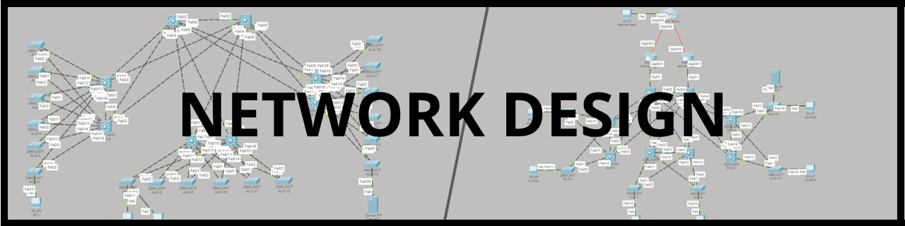

# Network Design — Jönköping University

Campus and WAN design in Cisco Packet Tracer

---

Coursework from two connected network design courses at JU's School of Engineering. Both projects follow the same scenario: IT wants to rebuild the university network over the summer, and students are proving out the design before anything goes live.

## Projects

| # | Course | Focus |
|---|--------|-------|
| 1 | [Switching & Routing](./project-1-switching-routing) | VLANs, inter-VLAN routing, RIP, RSTP, DHCP, HSRP, port-security |
| 2 | [WAN & Operator Network](./project-2-wan-operator) | OSPF, NAT/PAT, ACLs, eBGP, dual-homed Internet Edge |

Project 2 picks up from a simplified version of Project 1's topology, so the IP and VLAN plan carries across both.

## About the files here

No `.pkt` files or running configs are published. Both projects are active coursework that future students will be working on, and it didn't sit right to leave a full solution in a public repo. What's here is a description of what was built, with screenshots for context.
