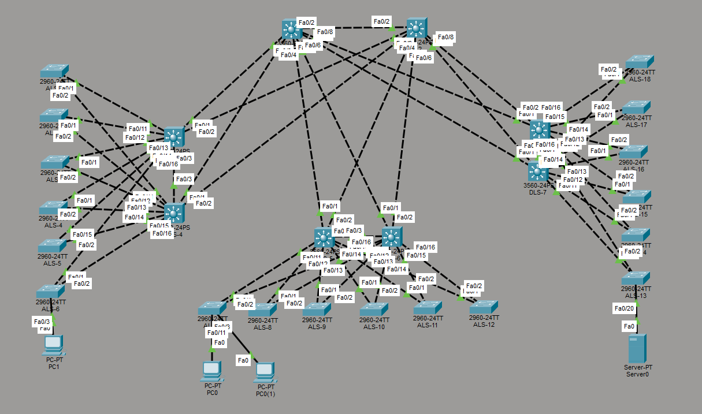

# Project 1 — Switching & Routing

A fictional rebuild of JU's campus network in Packet Tracer. Three faculties, 26 switches, six weeks of work. By the end it routes, fails over, hands out addresses on its own, and doesn't let you plug random gear into a wall port.

The work broke down into a handful of design problems, roughly in the order you'd hit them building this out for real.

### Getting hosts talking at all
VLANs split by role — students, staff, management — carried between switches on 802.1Q trunks with explicit allowed-lists per module, so no distribution module ever sees another's VLANs. Inter-VLAN routing lives on the first DLS of each module, via SVIs.

### Actually routing across the backbone
DLS-to-core uplinks flipped from trunks to routed L3 ports. RIPv2 between distribution and core, `passive-interface` on everything client-facing so the protocol doesn't leak onto user segments. A loopback on C1 as the canary: if every L3 switch can ping `8.8.8.8` (just a loopback, not the real thing), the domain is healthy.

### Not wasting half the uplinks to STP
Default spanning tree blocks one DLS uplink per VLAN, which is fine until you realize half your capacity is sitting idle. Rapid-PVST with per-VLAN root placement fixes it — DLS-3 is root for VLAN 10, DLS-4 is root for VLAN 11, and the forwarding paths alternate. Both links carry traffic under normal conditions; if one DLS dies, its partner picks up root duty for both.

### One DHCP server for six networks
A single external DHCP server sits on an ALS in the HLK module. Six pools, one per user VLAN. `ip helper-address` on every SVI lets clients anywhere in the network reach it through L3 forwarding.

### A default gateway that survives
HSRP on the user VLANs, with priorities deliberately matched to STP root placement so layer 2 and layer 3 agree on which DLS is forwarding for a given VLAN. Matters less in a simulator than it would in production, but the design habit is the point.

### One MAC per port
Port-security on ALS1-6 client-facing ports, shutdown on violation. Tested by plugging a small unmanaged switch with two PCs into a single port — port went err-disabled inside a second.
